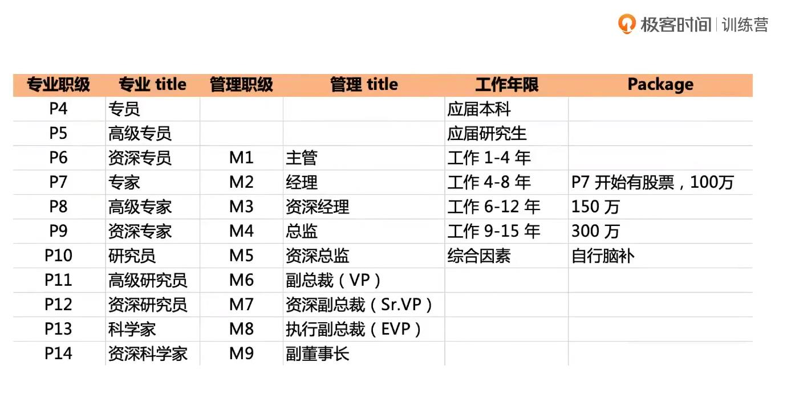
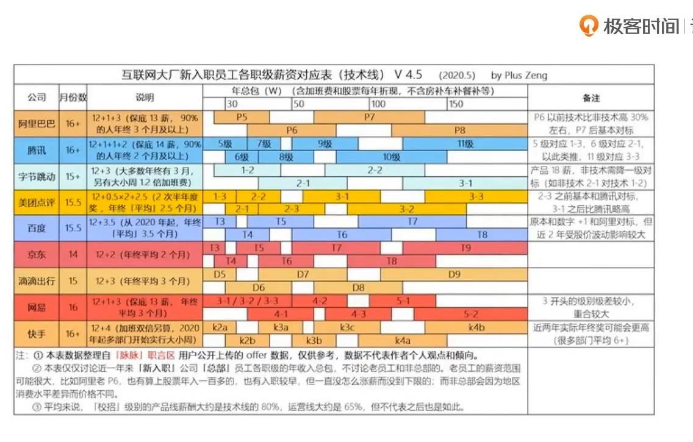
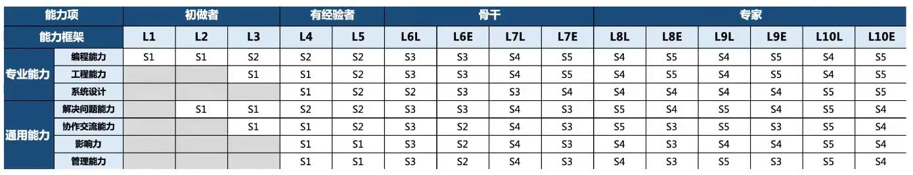

<h1 align='center'>程序员职业生涯</h1>

<h3 >目录</h3>

- [一、关于面试的一些事](#一关于面试的一些事)
- [二、测试](#二测试)

#### 一、关于面试的一些事
> [技术面试官最喜欢什么样的候选人](https://www.bilibili.com/video/BV1vf4y1u7VW?from=search&seid=15581572562717353932&spm_id_from=333.337.0.0)
1. 这是我在一个老师直播上看到的职业生涯图，如果你在对应的年限里没有达到这个技术，那么你将会比同行落后 
    
2. 你知道吗？
   + 35岁真的失业吗，失业之后干什么？
   + 简历里的一个错字会断送你的前程，主要是技术名的错字。
   + 面试里并不是答对每一个问题就能拿到offer。
   + 大部分时间面试官都在想：给我一个录用你的理由
   + 3年经验不比1年强多少。当你工作十年回过头来看其实并不大。
   + 自认为没有短板比问题一堆可怕多了（对自己认知有问题）
   + 当前技术能力到哪个公司都能拿到相同水平的offer（这是不对的）。
   + 想好要问面试官什么问题了么。
3. 面试的本质：身份平等，实力说话，充分沟通，双向选择。
   + 简单来说要自信，不要畏畏缩缩
4. 萝卜和坑的供需匹配问题
   + 你是个啥样的萝卜，是不是个好萝卜，你比其他的萝卜强在哪里。
   + 这有没有好坑，怎么知道自己合适什么坑，这个坑能不能装下你，会不会是个天坑，还有没有其他坑。
5. 面试流程：小公司一般就两轮
   + HR---->核心骨干---->直接上级---->间接上级---->HR
   + HR---->核心骨干--(交叉面试)-->直接上级--(交叉面试)-->间接上级--(CXO VP)-->HR
   + 每一轮通过率一般不会高于50%
6. 面试常见评语关键词：（没有十全十美的人）
   + 成长目标、执行能力、自我认知、自驱力、方法论、综合素质、逻辑思维、沟通理解
   + 行业视野、设计思维、技术深度/广度、项目经验、管理风格、领导力、潜质 
7. 技术人员的能力模型：人生就是打怪升级 
   
8. 简历注意什么
   + 自我总结（给你有限的时间怎么推销自己）、项目价值、技术亮点
   + 突出亮点、突出亮点、突出亮点
   + 避免低级错误，尤其技术名词
   + 不要造假！不要造假！不要造价！（可以美化）
9. 终面聊什么：（一半是比较牛逼的人物）
   > 直接给观点，不需要铺垫 
   > 没听懂就问，不懂就直说 
   > 有一说一，不扯闲篇 
   + 封闭性问题：（注意背后的隐藏思考）
     - 老家是哪儿的？住在哪边儿？结婚了么？孩子几岁了？
   + 开放性问题：
     - 为什么换工作？你的职业目标？说说对我们公司的认识？哪方面能力最强？
     - 印象最深刻的项目（你主导的，有什么改进空间）
     - 出过什么问题或者趟过什么坑？
     - 怎么带团队或者项目
     - 优势和劣势
     - 通过什么方式提高能力，那个方式最有效，什么兴趣爱好(最好和能拿offer最有帮助的)
   + 奇袭：有些面试官喜欢奇袭，问一些奇葩问题（一个问题被追着问5个问题：why why why why why）
     - 刚才那本书的作者叫什么，是什么背景？
     - 如果上级跟你的想法不一样怎么办？
     - 项目因为依赖方原因可能延期怎么办？
     - 如果给你个动物园你怎么管？
     - 世界上最好的语言是Php吗？
     - 我们的系统有什么问题？
     - 你有什么理想？
     - 最不能忍什么？
     - 最近在关注什么？
     - 还有么？（可能是没有听到想要的答案）
    + 还有什么想了解的？（隐含项：你能不能提出问题来，了不了解这个公司，这个职位）

#### 二、测试